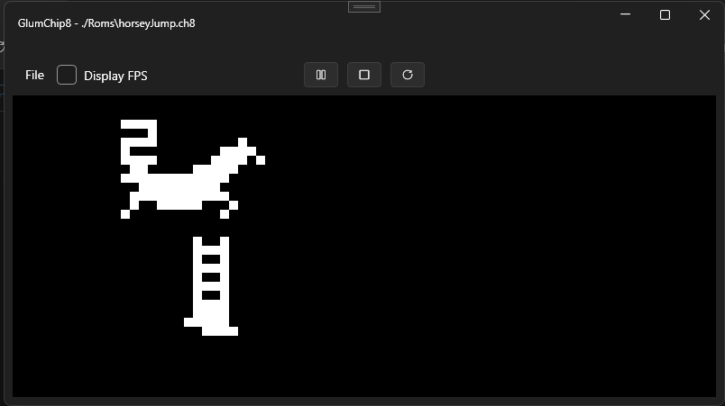

# GlumChip8
Chip8 emulator written in C#, using raylib for video, audio and input.

# Note
Documentation/proper readme will follow for this project once it is more complete, so to speak.
Below is an image of the emulator running the IBM logo test rom!

# Emulator running on windows 

